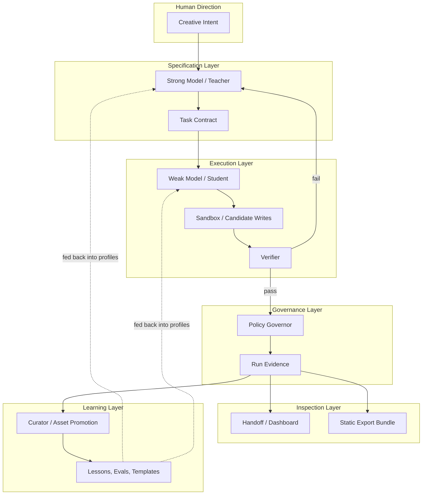

# Feiyue Architecture

Feiyue is a self-evolving AI development orchestrator built on top of Hermes Agent. The architecture separates specification (strong models), execution (weak models), verification, policy, and curation into distinct roles, connected by typed evidence at every boundary.

## System Flow

## Core Roles

### Human Creative Direction

The human supplies taste, product intent, and authorization decisions. Human approval is treated as explicit evidence, not model memory.

### Strong Model / Teacher

The strong model role is responsible for specification, task decomposition, and sparse guidance. Successful patterns reduce teacher dependence over time as lessons and routing rules accumulate.

### Weak Model / Student

The weak model role attempts bounded execution within sandboxed constraints. In the provider-free implementation, student behavior is deterministic so tests and CI do not depend on live model calls.

### Verifier

The Verifier is the single source of truth for pass/fail behavior. A workflow is not considered successful because a model says it is; it is successful only when the verifier and persisted evidence agree.

### Policy Governor

The Policy Governor gates high-risk operations — retries, teacher calls, promotions, and production changes. It produces auditable decisions and escalates to human approval when required.

### Curator

The Curator reviews successful run evidence, promotes reusable assets (lessons, regression evals, task templates), and manages the asset lifecycle. Promoted assets feed back into model profiles to reduce errors and teacher calls on future runs.

## Evidence and Handoff Surfaces

### Run Evidence

Run Evidence is persisted under `.hermes/runs/<task_id>/run-evidence.json`. It captures:

- status;
- policy action and reason;
- execution evidence;
- retry and promotion evidence;
- approval evidence;
- `safe_to_retry` and `next_safe_action`;
- report paths.

### Handoff Summary

Fallback handoff summaries render compact Markdown from run evidence so a fallback model or human operator can resume without guessing.

### Read-only API / Dashboard

The local API and dashboard are read-only inspection surfaces. They do not execute retries, promotions, approvals, or provider calls.

### Static Export Bundle

Static Export Bundle is the portable offline report surface. The export-all pipeline renders HTML, a `manifest.json`, a ZIP bundle, extracts it, and verifies the extracted report.

## Provider-Free Foundation

The current implementation validates all system boundaries without using real provider credentials or mutating Hermes configuration:

- deterministic workflow execution;
- verifier-gated retry and promotion;
- policy evidence and fallback handoff;
- read-only dashboard and API inspection;
- static report export and verification;
- provider-free smoke tests and benchmarks;
- CI quality gates.

## Gated Future Work

The following are explicitly gated and require separate authorization:

- real provider execution with credentials;
- Hermes profile scheduling and multi-worker routing;
- real weak-model vs strong-model benchmark calls;
- production promotion and rollback automation;
- long-lived sensitive artifact storage.
