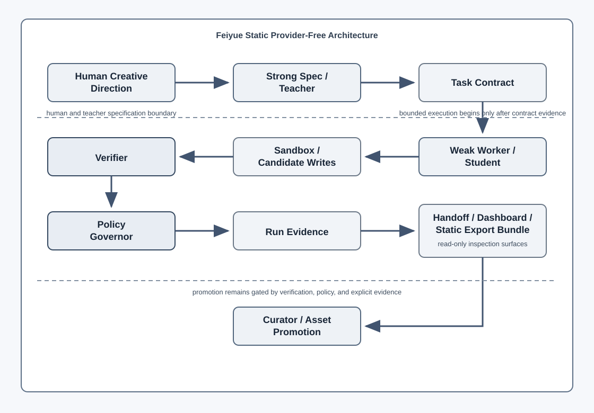

# Feiyue Architecture

Feiyue is a Hermes-based Creative Evolution Loop Orchestrator. The current implementation is a Provider-Free Foundation: it validates the system boundaries, recovery surfaces, safety gates, and handoff artifacts without using real provider credentials or mutating Hermes configuration.

## System Flow

The static diagram below is checked into the repository and uses only local SVG markup.



```text
Human Creative Direction
  -> Strong Spec / Teacher
  -> Task Contract
  -> Weak Worker / Student
  -> Sandbox / Candidate Writes
  -> Verifier
  -> Policy Governor
  -> Run Evidence
  -> Handoff / Dashboard / Static Export Bundle
  -> Curator / Asset Promotion
```

## Core Roles

### Human Creative Direction

The human supplies taste, product intent, and authorization decisions. Human approval is treated as explicit evidence, not model memory.

### Strong Spec / Teacher

The strong model role is responsible for PRD/spec/task-contract quality and sparse guidance. In the current provider-free implementation, teacher behavior is deterministic fake guidance so that tests and CI do not depend on live model calls.

### Weak Worker / Student

The weak worker role attempts bounded execution. Current examples use deterministic candidate writes and toy workflows to prove execution, verifier failure, teacher retry, and verified promotion behavior.

### Verifier

The Verifier is the source of truth for pass/fail behavior. A workflow is not considered successful because a model says it is successful; it is successful only when the verifier and persisted evidence agree.

### Policy Governor

The Policy Governor gates high-risk, sensitive, retry, teacher-call, token, and promotion decisions. It produces auditable decisions and blocks or escalates before side effects when required.

## Evidence and Handoff Surfaces

### Run Evidence

Run Evidence is persisted under `.hermes/runs/<task_id>/run-evidence.json`. It captures:

- status;
- policy action/reason;
- execution evidence;
- retry evidence;
- promotion evidence;
- approval evidence;
- `safe_to_retry`;
- `next_safe_action`;
- report paths.

### Handoff Summary

Fallback handoff summaries render compact Markdown from run evidence so a fallback model or human operator can resume without guessing.

### Read-only API / Dashboard

The local API and dashboard are read-only inspection surfaces. They do not execute retries, promotions, approvals, or provider calls.

### Static Export Bundle

Static Export Bundle is the portable offline report surface. The export-all pipeline creates HTML, `manifest.json`, a ZIP bundle, extracts it, and verifies the extracted report.

## Provider-Free Foundation

The current foundation proves:

- deterministic workflow execution;
- verifier-gated retry and promotion;
- policy evidence;
- fallback handoff;
- read-only dashboard/API inspection;
- static report export and verification;
- provider-free example smoke;
- provider-free benchmark smoke;
- CI quality gates.

## Explicitly Gated Future Work

The following are not enabled by this architecture yet:

- real provider execution;
- Hermes profile scheduling;
- real weak-model vs strong-model benchmark calls;
- real multi-worker routing;
- production promotion / rollback automation;
- long-lived sensitive artifact storage.

These require explicit human authorization and additional fake-provider tests before any real credential or model call is introduced.
